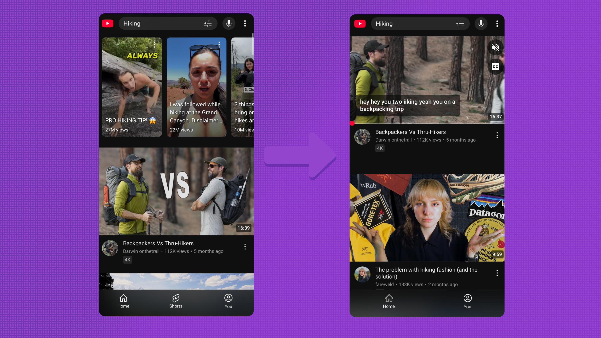

# ShortsBlocker

  

**ShortsBlocker** is a Swift-based Safari Extension designed to block YouTube Shorts from appearing while you browse YouTube. This extension helps you avoid distractions and focus on regular video content by hiding or removing Shorts elements from the YouTube interface.

## Features

- Blocks YouTube Shorts on the main page and video pages
- Code is available for anyone to see or modify
- Easy to install and use

## Screenshots

## Prerequisites

- Mac that is able to run macOS 15 Sequoia
- Latest version of XCode
- iPhone with iOS >= 15

## Installation

1. Clone or download this repository
2. Open the project in Xcode
3. Enable developer mode on your iPhone device
4. Connect your iPhone to your Mac via USB
5. Build and run the project to install the App
6. Open the App and follow the instructions

## Contributing

1. Fork the Project
2. Create your Feature Branch (`git checkout -b feature/AmazingFeature`)
3. Commit your Changes (`git commit -m 'Add some AmazingFeature'`)
4. Push to the Branch (`git push origin feature/AmazingFeature`)
5. Add yourself to the CONTRIBUTORS.txt file
6. Open a Pull Request

## License

This project is licensed under the MIT License.
